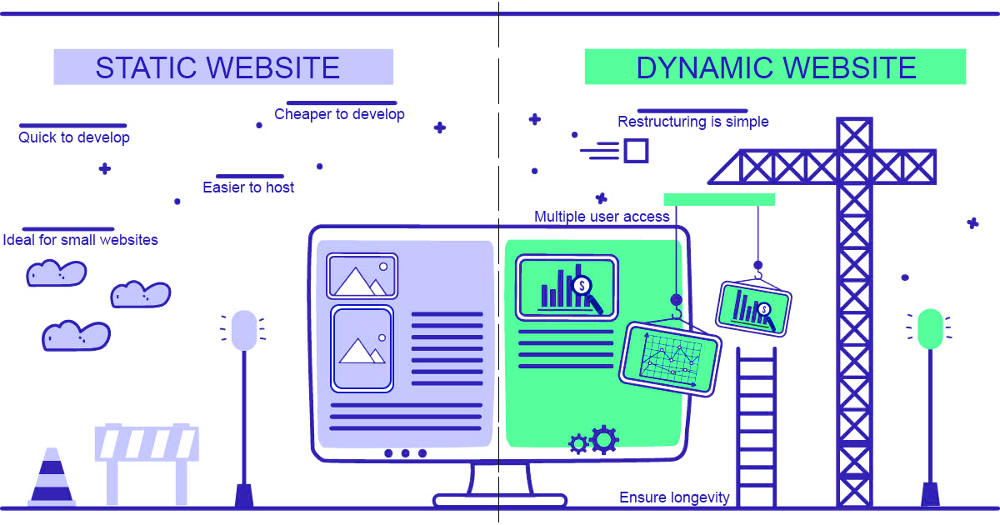
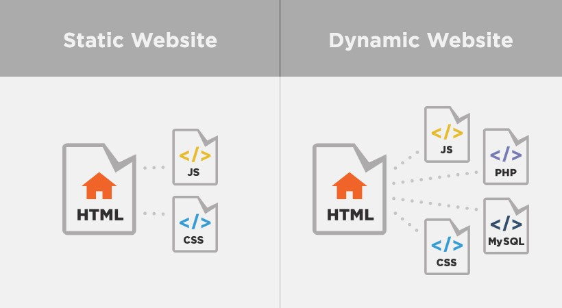
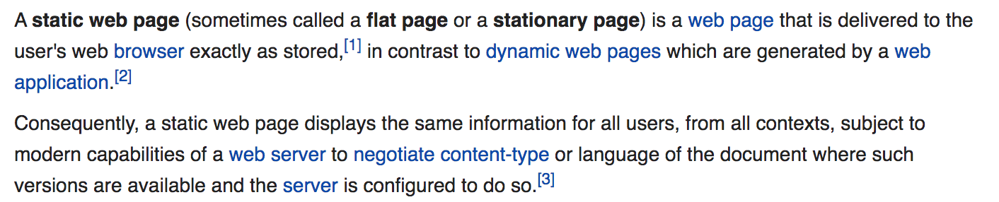

# Generalizing Static Sites

This workshop is intended to give a broad overview to static sites, what they are, why and when to use one, and the many different flavors for building them. This is also a work-in-progress so together we're going to discuss the best way to learn about static sites and how I might improve this workshop going forward.

## What is a Static Site?






[From Wikipedia](https://en.wikipedia.org/wiki/Static_web_page)



Static sites are usually defined by what they aren't - namely web applications. This definition can be a bit confusing though because static sites still need to be hosted by a server and are written in programming languages that you might use to build web apps. Even more confusing is that you can still have dynamic, user interactive content on a static site through JavaScript.

So, is there actually any difference between static sites and dynamic web apps?

While increasingly the two overlap, one of the main differences remains that static sites do not have live databases. You might still have data on a static site (a JSON file for example) but this data gets loaded with the website, not after the fact.


## Why are static sites so popular? What are the tradeoffs?

[How (and Why) to Generate a Static Website Using Jekyll, Part 1 by Alex Gil, 2015](https://www.chronicle.com/blogs/profhacker/jekyll1/60913)

Outlines some of the main benefits of Static Sites in 2015:

- Does not require security patches and are not vulnerable to being hacked like a Wordpress site

- Requires less maintenance and has a lower carbon footprint
  
- Loads faster than dynamically generated web pages

- Allows you to customize your website

*Are these still the benefits in 2019?*

Yes and no.

Even with a static site, you'll still need to manage package dependencies and web server hosting for the static site, both of which can be vulnerable to security breaches.

Static sites might be less work than a web application, but they do require more technical maintenance than a Wordpress site.

Static sites can have a lower carbon footprint, but measuring carbon footprint for websites can be tricky. A static site might load faster on the web, but can also be very slow to load when you're building the site locally, depending on the generator you choose.

*Where static sites shine?*

- Version control (if you use git)
- No clunky CMS (get to edit content directly)
- Portability (you can easily take your content with you in a sustainable way)

Overall, recommend if you have:

- an interest in coding
- want to customize your website
- care about minimizing the size of your website and controling what infrastructure it relies on

In the end, static sites can be just as time consuming (if not more) than a free Wordpress or Tumblr site, but also empower you to create what you want. 


## How does a static site actually work?

A google search for static site generators returns millions of medium and quora posts debating which static site is the best, but few of these actually delve into the mechanics.

Fundamentally, a static site generator takes some form of plain text file and transforms it into html files. These generator libraries will also let you style your website using a combinator of layouts, modular html, style sheets, and javascript.

Most static site generators rely on similar patterns for how to manipulate your data, even if the details differ.

To get a static site generator on your computer, means the first step is to usually download a code library. These libraries contain the code to transform your data, and they are almost always available to see on github if you want to delve deeper.

Pelican:
```bash
pip install pelican
```

Jekyll:
```bash
gem install jekyll
```

Hugo:
```bash
brew install hugo
```

Gatsby:
```bash
npm install -g gatsby-cli
```

The next step is to find a tutorial or look at the documentation for how to setup a project locally. This step will usually involve typing a command in your terminal shell that tells the static site generator to create a new project.

Pelican:
```bash
pelican-quickstart
```

Jekyll:
```bash
jekyll new-project
```

Hugo:
```bash
hugo new site quickstart
```

Gatsby:
```bash
gatsby new gatsby-site
```

You'll then see a bunch of activity in your terminal and when it's completed you'll have an entire project structure in what was once an empty directory.

Pelican:
```python3
yourproject/
├── content
│   └── (pages)
├── output
├── tasks.py
├── Makefile
├── pelicanconf.py       # Main settings file
└── publishconf.py       # Settings to use when ready to publish
```

Jekyll:
```bash
.
├── _config.yml
├── _data
|   └── members.yml
├── _drafts
|   ├── begin-with-the-crazy-ideas.md
|   └── on-simplicity-in-technology.md
├── _includes
|   ├── footer.html
|   └── header.html
├── _layouts
|   ├── default.html
|   └── post.html
├── _posts
|   ├── 2007-10-29-why-every-programmer-should-play-nethack.md
|   └── 2009-04-26-barcamp-boston-4-roundup.md
├── _sass
|   ├── _base.scss
|   └── _layout.scss
├── _site
├── .jekyll-metadata
└── index.html # can also be an 'index.md' with valid front matter
```

Gatsby:
```javascript
/
|-- /.cache
|-- /plugins
|-- /public
|-- /src
    |-- /pages
    |-- /templates
    |-- html.js
|-- /static
|-- gatsby-config.js
|-- gatsby-node.js
|-- gatsby-ssr.js
|-- gatsby-browser.js
```

Almost all of them have a configuration file with top level information about the project.

Pelican:
```bash
nano pelicanconf.py
```

Jekyll:
```bash
nano _config.yaml
```

Hugo:
```bash
nano config.toml
```

They have a folder(s) where you edit the content of your blog posts, pages, projects, etc... that is usually in the form of markdown files.

Pelican or Hugo
```bash
cd content
ls
```

Jekyll:
```bash
cd posts
```

They have folders where you store images, files, etc... as assets.

Pelican:
```python3
content
├── images
│   └── han.jpg
├── pdfs
│   └── menu.pdf
└── pages
    └── test.md
```

Hugo:
```go
.
└── content
    └── about
    |   └── index.md  // <- https://example.com/about/
    ├── posts
    |   ├── firstpost.md   // <- https://example.com/posts/firstpost/
    |   ├── happy
    |   |   └── ness.md  // <- https://example.com/posts/happy/ness/
    |   └── secondpost.md  // <- https://example.com/posts/secondpost/
    └── quote
        ├── first.md       // <- https://example.com/quote/first/
        └── second.md      // <- https://example.com/quote/second/
```

They have html files that you can edit to customize layouts of your web pages, and folders that contain CSS and JavaScript files.

Pelican:
```python3
├── static
│   ├── css
│   └── images
└── templates
    ├── archives.html         // to display archives
    ├── period_archives.html  // to display time-period archives
    ├── article.html          // processed for each article
    ├── author.html           // processed for each author
    ├── authors.html          // must list all the authors
    ├── categories.html       // must list all the categories
    ├── category.html         // processed for each category
    ├── index.html            // the index (list all the articles)
    ├── page.html             // processed for each page
    ├── tag.html              // processed for each tag
    └── tags.html             // must list all the tags. Can be a tag cloud.
```

Jekyll:
```bash
cd layouts #or includes
cd sass
```

They have themes that you can install to change the styling of your website.

Pelican:
```bash
pelican-themes --list
```

Hugo:
```bash
# Download the theme
git init
git submodule add https://github.com/budparr/gohugo-theme-ananke.git themes/ananke
# Note for non-git users:
#   - If you do not have git installed, you can download the archive of the latest
#     version of this theme from:
#       https://github.com/budparr/gohugo-theme-ananke/archive/master.zip
#   - Extract that .zip file to get a "gohugo-theme-ananke-master" directory.
#   - Rename that directory to "ananke", and move it into the "themes/" directory.
# End of note for non-git users.

# Edit your config.toml configuration file
# and add the Ananke theme.
echo 'theme = "ananke"' >> config.toml
```

And finally, they have commands that you can use to build the site:

```bash
pelican /path/to/your/content/ [-s path/to/your/settings.py]
```

Jekyll:
```bash
bundle exec jekyll build
```

Hugo:
```bash
hugo -D
```

Gatsby:
```build
gatsby build
```

And host the site locally:

Python:
```bash
pelican --listen
```

Jekyll:
```bash
bundle exec jekyll serve
```

Hugo:
```bash
hugo server -D
```

Gatsby:
```bash
gatsby develop #or serve
```

## Hosting and Testing Static Sites

- Github
  - [Hosting your static site through Github Pages (this example is with jekyll)](https://help.github.com/en/github/working-with-github-pages/setting-up-a-github-pages-site-with-jekyll)

  - [Configuring a custom domain with Github Pages and a static site](https://help.github.com/en/github/working-with-github-pages/configuring-a-custom-domain-for-your-github-pages-site)

- Netlify (Better for larger projects with a team)
  - [Netlify docs](https://docs.netlify.com/configure-builds/get-started/)
  - Provides continuous deployment while you're developing so that you can share URLs
  - [Github Pages vs Netlify](https://www.netlify.com/github-pages-vs-netlify/)

- Testing and TravisCI
  - Used for testing your code before you push your code to Github *and* for making sure your code is not broken when it's hosted
  - [Travis CI ](https://travis-ci.org/) and [docs](https://docs.travis-ci.com/)
  
```bash
#!/usr/bin/env bash
set -e # halt script on error

# bundle exec jekyll build
# # bundle exec htmlproofer ./_site
# # to exclude external sites
# bundle exec htmlproofer ./_site --disable-external
bundle exec jekyll build && bundle exec htmlproofer ./_site \
  --assume-extension \
  --empty-alt-ignore \
  --disable-external \
  --alt-ignore '/.*/' \
  --allow-hash-href \
  --only-4xx \
  --http-status-ignore 429,403,404,410 \
  --file-ignore /.*\/node_modules\/.*/ \

  # --url-ignore '/http://www.gutenberg.org/*/','/https://github.com/programminghistorian/jekyll/(commits|blob)/*/','/\#/',"/espanol/","/deprecated/",'/collection.britishmuseum.org/','/analytics.hathitrust.org/'
```

## Try out some Static Sites

Almost every programming language has a static site generator, if not multiple.

Check out the [list of top static site generators](https://www.staticgen.com/) and [curated list of static site resources](https://github.com/myles/awesome-static-generators) to find out about what's available.

The only way I've ever learned anything about coding is by coding (original I know!).

Today the goal is for you try and get at least one, but ideally two of these static site generators up and running on your local computer (alternatively depending on bandwidth we can talk more too!).

1. Jekyll and Ruby

Jekyll is the workhorse of DH, but has become less popular in recent years in the broader development community.

- [How to quickstart with Jekyll](https://jekyllrb.com/docs/installation/macos/) and [tutorial](https://jekyllrb.com/docs/step-by-step/01-setup/)

- [Jekyll Github Repo](https://github.com/jekyll/jekyll)
  
- [Jekyll Themes](http://jekyllthemes.org/)

- [Jekyll style guide](https://ben.balter.com/jekyll-style-guide/)

- [Setting up a GitHub Pages site with Jekyll](https://help.github.com/en/github/working-with-github-pages/setting-up-a-github-pages-site-with-jekyll)

- [Jekyll’s documentation on migrating existing websites](https://import.jekyllrb.com/docs/home/)

- [Ben Balter’s WordPress plugin for exporting data from WordPress into Jekyll](https://wordpress.org/plugins/jekyll-exporter/)

- [Exitwp, a Python script developed by Thomas Frössman](https://github.com/thomasf/exitwp)

- [Programming Historian's Jekyll Lesson](https://programminghistorian.org/en/lessons/building-static-sites-with-jekyll-github-pages) and [newly proposed lesson](https://programminghistorian.github.io/ph-submissions/lessons/collaborative-blog-with-jekyll-github)

Example sites with Jekyll
- [Scholars' Lab website](https://scholarslab.lib.virginia.edu/) and [github repo](https://github.com/scholarslab/scholarslab.org)

- [Programming Historian](https://programminghistorian.org/) and [github repo](https://github.com/programminghistorian/jekyll)
  
- [Wax a Jekyll version of Omeka](https://minicomp.github.io/wax/) and [Ed a Jekyll theme for minimal computing](http://elotroalex.github.io/ed/)
  
1. Pelican and Python

- [Pelican Github Repo](https://github.com/getpelican/pelican)

- [Pelican Quickstart docs](https://docs.getpelican.com/en/stable/quickstart.html)

- [Pelican Themes](https://docs.getpelican.com/en/stable/pelican-themes.html)

Example sites with Pelican:
- [Personal Website example](https://kevinyap.ca/) and [github repo](https://github.com/iKevinY/iKevinY.github.io)
- [Andrew Heiss website](https://www.andrewheiss.com/) and [github repo](https://github.com/andrewheiss/ath-pelican)

1. Gatsby and React

- [Gatsby tutorials](https://www.gatsbyjs.org/tutorial/)
- [Gatsby Github Repo](https://github.com/gatsbyjs/gatsby)
- [Gatsby with Github Pages](https://www.gatsbyjs.org/docs/how-gatsby-works-with-github-pages/)
- [Awesome Gatsby Resources](https://github.com/prayash/awesome-gatsby)
- [Gatsby Themes](https://www.gatsbyjs.org/docs/themes/)

Example sites with Gatsby
- [Gatsby demo site](https://cara.lekoarts.de/) and [github repo](https://github.com/LekoArts/gatsby-starter-portfolio-cara)
- [Tania Rascia's personal website](https://www.taniarascia.com/) and [github repo](https://github.com/taniarascia/taniarascia.com)

1. Hugo and Go

- [Hugo quick start](https://gohugo.io/getting-started/quick-start/)
- [Hugo documentation](https://gohugo.io/documentation/) and [github repo](https://github.com/gohugoio/hugo)
- [Hugo Themes](https://themes.gohugo.io/)
  
Example sites with Hugo
- [Jason Heppler's personal website](https://github.com/hepplerj/jasonheppler.org)
- [Grant Wythoff's personal website](https://wythoff.net/)

## Some broader questions to help you decide what's the best fit for you

1. What programming language are you interested in using or learning? Most of these involve using HTML, CSS, and JavaScript, but some like GatsbyJS require some knowledge of React whereas Jekyll only requires a tiny bit of Ruby to work in the Makefile

2. How much complexity will your site have? How many pages? How many different types of content? Some static site generators and themes make assumptions for how your content is organized so you may want to find a fairly close example project.

3. How many contributors? If you are working on a team, you'll want to invest in testing, continuous integration and deployment to make sure the site doesn't break. You'll also want to decide on an editorial process (for an example see [the submissions process for the Programming Historian](https://github.com/programminghistorian/ph-submissions)).

4. How much do you want to customize your site? Some static site generators like Gatsby are easier to customize the styling, whereas others have a whole host of themes to choose from but are harder to manipulate.